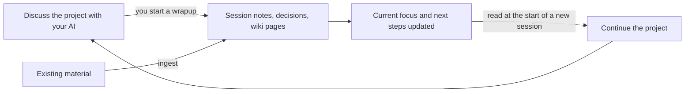

# Loom

**English** | [简体中文](README.zh-CN.md)

<p align="center">
  
</p>

**Keep the record of a long project with your AI: what you know, why you decided, and where to continue.**

A project that runs for weeks with an AI assistant produces more than its final output: conclusions, the sources behind them, the options you turned down and why. Almost all of that stays in chat logs. So a new session starts from zero and you explain the background again. A month later nobody remembers why a choice was made, and it gets argued a second time. And when someone asks where a claim came from, or you want to hand over the results without the whole history, there is nothing ready to give.

Loom is a project knowledge-base skill for AI assistants. It has the AI turn sources, discussions, and decisions into interlinked local Markdown files, with each kind of knowledge in its own place and every change recorded by git. The project ends up with a record you can read, check, and share, and that any later session can continue from.

## What you get

- **A next session that starts where you stopped.** One page, [`hot.md`](examples/reading-notes/en/00-Hub/hot.md), holds the current focus, open questions, recent decisions, and next steps. It is the first thing a new session reads, so you don't explain the background again.
- **Decisions that stay decided.** One [record per decision](examples/reading-notes/en/40-Sessions/decisions/DR-2026-001_v1-local-excerpts.md): the options compared, the trade-offs, the strongest counterargument, your confidence, what you gave up, and a review date. Loom reminds you when a review is due, so a choice is revisited when its date or its constraints come up, not whenever someone forgets the reasoning.
- **Conclusions you can trace.** Originals are stored untouched and registered. New understanding goes into topic-organized wiki pages, where each claim cites the source or session note it rests on: [original](examples/reading-notes/en/20-Sources/raw/approach-options.md) → [source card](examples/reading-notes/en/20-Sources/cards/approach-options-card.md) → [wiki page](examples/reading-notes/en/30-Wiki/v1-scope.md). When new material contradicts what you already hold, you are told.
- **Results you can share without the process.** `publish` exports a reviewed snapshot of the current state. Conversations, session notes, decision records, and history never go in, and you confirm the file list first.
- **A record that is yours.** Everything is local Markdown under git: you can read it, diff it, correct it, and roll it back, and it moves with you to another AI tool.

## When it pays off

Loom repays its upkeep when a project is long, has real decisions in it, and produces judgment as much as it produces files.

| Situation | Without a record | What Loom keeps |
|---|---|---|
| Weeks or months of research, option selection, or product definition | Conclusions are buried in chats and the same question is argued again | Wiki pages by topic; one record per decision, with a review date |
| Many papers, reports, and web pages to digest | Material piles up and nobody can say where a claim came from | Untouched originals, a source index, source cards, and claims that cite their source |
| Engineering that spans several repositories | The reasoning behind the design belongs to no single repository | Project context and decisions above the repositories, linked to the related commits |
| Work that pauses for weeks, changes hands, or moves to another AI tool | The context lives in one person's head or one tool's history | The brief, current focus, timeline, and roadmap as plain files |
| Delivering results to a client or collaborator | Sharing means handing over everything, or rewriting by hand | Versioned deliverables, and reviewed snapshots that leave the process out |

Rows two, three, and five correspond to the optional `research`, `engineering`, and `outputs` modules, described in [Three common ways to use it](#three-common-ways-to-use-it). As a rough threshold: more than a handful of sessions on the same project, with choices you will have to explain later. You can start from a one-line idea, a pile of existing material (documents, PDFs, saved web pages), or one or more existing code repositories.

**It is probably not worth it if:**

- the task is finished in one or two sessions, because the record will not be read again;
- you write code in a single repository that already has good docs, where its `AGENTS.md` and git history carry enough;
- you only use a web chat window where the AI cannot touch local files;
- you expect it to remember everything automatically once installed;
- you need real-time multi-user editing, since Loom shares work by publishing reviewed snapshots;
- you are building an agent product and need memory for its end users, which is a job for a memory layer.

**What it asks of you:**

- **You start the archiving.** If you stop wrapping up, the record falls behind, and an outdated `hot.md` misleads the next session more than no record would. `lint` and, in Claude Code, the session-start reminder list sessions that have not been archived, but they do not archive them for you.
- **A wrapup takes a few minutes.** The AI reads and writes several files and makes a commit. In Claude Code, Loom's rules and `hot.md` are also injected at the start of every session.
- **Finding things is an index page plus file search, inside one project.** There is no semantic search and nothing that spans projects.

## Loom and AI memory

Assistants increasingly have memory of their own: they note your preferences, pick facts out of conversations, or summarize past sessions and bring them back automatically. Loom is not one of these and does not replace them. It does not change the model's memory at all. It saves and organizes project records and has the AI read them when needed. There is no vector database, background service, or web UI, only files, git, and scripts that use the Python standard library.

| | Assistant memory | Loom |
|---|---|---|
| Holds | Your preferences and habits, and facts picked up along the way | One project's record: sources, knowledge pages, decisions, deliverables, conversations |
| Written | Automatically, in the background | By the AI when you start a wrapup or an ingest, following a fixed workflow; each one is a git commit |
| Organized as | Remembered items, brought back by relevance | Typed notes: facts, discussions, decisions, deliverables, and originals each have one home |
| Decisions | Remembered as facts, if at all | Options, reasoning, counterargument, confidence, and a date to review |
| Checking it | Depends on the product | Plain files you can read, diff, correct, and roll back |
| Sharing | Usually tied to an account or a tool | Reviewed snapshots for collaborators; the files work in any tool that can read them |
| Scope | Follows you across projects | Stays in one project folder |

The two complement each other: memory keeps how you like to work, and Loom keeps what the project is and why. Carrying on from the last session is the part that memory features also cover. If that is all you need, built-in memory is enough and Loom would only add upkeep. The rest is what Loom is for: knowledge with sources, decisions with their reasoning and a review date, a history you can audit, and sharing with a boundary.

## How it works

- **How you use it:** in natural language — "initialize this project with Loom", "wrap up this discussion", "ingest these materials". The AI follows Loom's workflow to read and write files in your project folder.
- **What is automatic:** archiving is something you start. In Claude Code, hooks additionally export the raw conversation when a session ends and inject the current focus when one starts; other tools don't have this layer (see [support scope](#support-scope-and-privacy)).
- **Where the result lives:** in your project folder — a set of interlinked Markdown files, with every change recorded by git. Obsidian is a convenient way to browse them, not a prerequisite.

> A *skill* is a set of instructions and scripts that let an AI assistant follow a fixed workflow on your files. Loom follows the open [Agent Skills](https://agentskills.io) standard: install it once on your machine and every project can use it; project folders hold only data.

## One full cycle

The walkthrough uses a fictional demo project, `reading-notes-demo` (a personal reading-excerpt tool; all content is invented for demonstration). The whole cycle is three sentences:

```text
Initialize this project with Loom. The goal is a personal reading-excerpt tool.

Wrap up the discussion we just had with Loom — record the v1 scope decision and the next step.

This is a Loom project. Read hot.md and the related decisions first, then keep refining the v1 feature list.
```

The third line is a natural-language request in a *new* session — there is no "resume" command; reading the saved context is the resume.

What the second sentence (the wrapup) leaves behind:

| Before the wrapup | After the wrapup | How the next session uses it |
|---|---|---|
| The discussion in this chat | A [session note](examples/reading-notes/en/40-Sessions/notes/2026-10-01_v1-scope.md) with conclusions and open questions | Read when background is needed |
| A spoken decision to defer sharing | A [decision record](examples/reading-notes/en/40-Sessions/decisions/DR-2026-001_v1-local-excerpts.md) with the options compared, the rationale, the strongest counterargument, and a review date | Avoid re-discussing; revisit when constraints change |
| To-dos mentioned in chat | [hot.md](examples/reading-notes/en/00-Hub/hot.md) and the [roadmap](examples/reading-notes/en/00-Hub/roadmap.md) updated | Know which next step to continue from |

`00-Hub/hot.md` is the first thing a new session reads. After the wrapup it looks like this (excerpt):

```markdown
## Current focus
- Turn the v1 scope ([[v1-scope]]) into a concrete feature list.

## Open questions
- Does plain-text search stay good enough at a few hundred excerpts?

## Recent decisions
- [[DR-2026-001_v1-local-excerpts]]: v1 supports local excerpts and search; sharing deferred.

## Next steps
- Write the minimal v1 feature list — see [[roadmap]]
```

The complete example is in [`examples/reading-notes/en/`](examples/reading-notes/en/) (and in Chinese in [`examples/reading-notes/zh-CN/`](examples/reading-notes/zh-CN/)). To try it hands-on, **copy the example into a separate directory** — do not run init inside the Loom source repository.



Archiving is something you start. The Claude Code hooks (raw conversation export, context injection) are a separate enhancement layer: raw export does no semantic organization and is not a substitute for a wrapup.

## Quickstart

Requirements: **Python 3.12+** and **git**. Claude Code hooks additionally need a working **Bash** (Git Bash on Windows).

**1. Install**

Windows:

```powershell
git clone https://github.com/Maxwell-FreeFOV/loom.git loom
cd loom
py tools/deploy.py
```

macOS / Linux:

```bash
git clone https://github.com/Maxwell-FreeFOV/loom.git loom
cd loom
python3 tools/deploy.py
```

The skill itself lands in `~/.agents/skills/loom`, and deploy links it into the skills directories of the tools it finds (`~/.claude/skills/loom` and `~/.codex/skills/loom` by default; `--agents claude,codex,gemini` to choose). Deploy first runs the repository's end-to-end tests, and the hook tests among them need Bash; add `--skip-tests` if you have no Bash or want to skip them.

Alternatively, copy `skills/loom/` into a tool's skills directory by hand, or use the [skills CLI](https://github.com/vercel-labs/skills): `npx skills add Maxwell-FreeFOV/loom -g --skill loom` (needs Node/npm).

**2. Create a project**

```bash
mkdir my-project && cd my-project
```

Start your AI assistant in this folder and say: *"Initialize this project with Loom."* The AI will ask a few questions (name, nature of the project, existing material), then generate the directory structure, `AGENTS.md`, the project brief, and `hot.md`. A folder that already contains material is fine — init registers it.

**3. Your first wrapup**

After discussing for a while, say: *"Wrap up this discussion with Loom."* (In Claude Code you can also type `/loom wrapup`.) The AI writes a session note; writes a decision record if a decision was made; updates the wiki pages, the roadmap, and `hot.md`; and finally makes one commit in the project's own git repository.

**4. The next session**

Open a new session in the same folder. In Claude Code, the hook injects `hot.md` and reminders at the start; in other tools, the note in `AGENTS.md` tells the AI to read them itself. You can also just say: *"This is a Loom project. Read hot.md first, then continue with …"*

**Check that it works**

1. Run `doctor` to check the environment — Windows: `py "$HOME/.agents/skills/loom/scripts/loom.py" doctor`; macOS/Linux: `python3 ~/.agents/skills/loom/scripts/loom.py doctor`.
2. Your AI lists `loom` among its available skills; after init, the project contains `.kb.json`, `AGENTS.md`, `00-Hub/hot.md`, and `10-Brief/project-brief.md`.
3. In Claude Code: a new session in a Loom project starts with a "Loom project context" block, and after the session ends the exported conversation appears under `40-Sessions/raw/`. `doctor` only checks files and configuration and cannot prove the hooks are live — this real-session check is the one that counts.

If your Claude Code version does not load the skill directory as a plugin, `py tools/deploy.py --claude-hooks` writes the same hooks into `~/.claude/settings.json` as a fallback.

To create a project without going through the AI: `py "$HOME/.agents/skills/loom/scripts/loom.py" init --name my-project --language en` (use `python3` instead of `py` on macOS/Linux; `--language zh-CN` for a Chinese project; omitted means English).

## Three common ways to use it

The core loop (discuss → wrap up → continue) is the same for any project. The three uses below are opt-in and correspond to three optional modules.

**Research.** You have papers, reports, and web pages to digest. Put the files into `20-Sources/inbox/` and say "ingest these materials with Loom": originals are stored untouched in `raw/` and registered in the source index, important ones get a source card, and new knowledge is integrated into the wiki with its source cited; anything that conflicts with what you already hold is reported to you separately. The `research` module adds literature-card and experiment-record templates.

**Engineering.** Design discussions, design documents, and decisions live in the knowledge base. Code repositories are registered in `repos.yaml` and live under `repos/`, each an independent git repository whose contents the knowledge base does not track. When you start a session inside one of those repositories to write code, the AI can still go back to the knowledge base for designs and decisions. The `engineering` module adds design-document and ADR templates, and decision records can reference the related commits.

**Deliverables and sharing.** Documents meant for other people — design docs, reports — go under `50-Outputs/` (the `outputs` module), with a version and a status, linked to the session notes, decisions, and wiki pages they rest on. To hand results to a collaborator, `publish` builds a snapshot zip: only the current state and results; conversations, session notes, decision records, and history never go in. Before anything is generated, the AI lists the files and the things worth a second look (local paths, email addresses, secret-like strings), and you confirm. The recipient hands the zip to `ingest` in their own Loom project.

All operations (`/loom <operation>` in Claude Code; in other tools, just say "use loom to …"):

| Operation | What it does |
|---|---|
| `init` | Set up a project: interview, choose modules, generate the layout and the project brief, register existing material |
| `wrapup` | When a discussion ends: write the session note and decision records, update the wiki, timeline, roadmap, and hot.md |
| `ingest` | Bring in material: store the original in `raw/`, register it in the source index, write a source card, integrate into the wiki. Also imports snapshots published by collaborators |
| `publish` | Export the shareable part of the knowledge base as a snapshot (a zip): no conversations, notes, decision records, or history; reviewed by the AI and confirmed by you first |
| `lint` | Health check: dead links, orphan pages, unregistered sources, unarchived sessions, decisions due for review |
| `module` | Enable modules: `research` (literature cards, experiment records), `engineering` (linked code repos), `outputs` (deliverables with versions) |
| `migrate` | Migrate a project's structure after a Loom upgrade |
| `close` | Review and wind down a project that is paused or finished |

## Support scope and privacy

**Languages.** Projects are created in English (`en`) or Chinese (`zh-CN`) via `init --language`; project files, templates, indexes, and reports are generated in the project's language. Projects created by older Loom versions are treated as Chinese and stay Chinese. **The skill's operating rules (`SKILL.md` and `references/`) are currently written in Chinese only.** You can drive every feature in English — the scripts are language-neutral — but the rule documents themselves have not been translated, and behavioral equivalence of an English ruleset has not been verified.

**Tool differences.** Loom is used and tested in **Claude Code** today. It is a standard Agent Skill and is designed to work in other tools that can run local commands, but how reliably those tools trigger it and follow its workflows has not been fully verified yet — reports are welcome. Raw conversation auto-export and context injection work **only in Claude Code**, via hooks:

| Capability | Claude Code | Other Agent Skills tools (Codex, Gemini CLI, etc.) |
|---|---|---|
| init, wrapup, ingest, publish, lint, module, migrate | ✅ | Expected to work (the AI must be able to run local commands); not fully verified |
| Auto-export of the conversation when a session ends | ✅ via hook | ❌ — conversations don't reach `40-Sessions/raw/`; session notes carry the content |
| Auto-injection of hot.md and reminders at session start | ✅ via hook | ❌ — `AGENTS.md` tells the AI to read them itself |
| Re-export of earlier conversations during Loom operations | ✅ | ❌ (only Claude Code's transcript format is supported today) |
| Invocation | `/loom <operation>`, or natural language | Natural language; sometimes say "use loom" explicitly |

In Claude Code, `.claude-plugin/plugin.json` and `hooks/hooks.json` in the skill directory make it load as the plugin `loom@skills-dir`, which is where the hooks come from; other tools ignore those files.

**Notes:**

- Claude Code periodically cleans up transcripts (`cleanupPeriodDays`, about 30 days by default). Loom re-exports conversations from these transcripts; consider setting it to 365 or more in `~/.claude/settings.json`.
- All projects share the installed Loom version. When a new version changes the project structure, `migrate` brings each project forward once.

**Privacy and git.**

- Your knowledge base is local Markdown files, but anything the assistant reads may be sent to the AI service you use — local storage does not mean content never leaves your machine.
- The Claude Code hooks export raw conversations into `40-Sessions/raw/` when a session in a Loom project ends; this happens only inside Loom projects, and removing the hook disables it.
- After a wrapup, ingest, or publish, the AI makes one commit in the project's own git repository; the workflow tells it to commit only the files that operation touched. Raw conversations and sources go into this local repository by default — use `.gitignore` for files you don't want committed. Loom never creates a remote or pushes, and the hooks do not rewrite existing commits unless you opt in (`auto_amend` in `.kb.json` is off by default).
- We recommend keeping project repositories private and sharing reviewed snapshots (`publish`) instead — snapshots never include conversations or history, and you confirm the file list before anything is generated. The cleaning rules are mechanical and do not replace your own review of the content.

## Further reading

**Directory layout of a project:**

```
<project>/
├── .kb.json            project name, modules, schema version, language
├── AGENTS.md           project instructions (one block is maintained by Loom); CLAUDE.md just references it
├── 00-Hub/             current focus (hot) · index · timeline · roadmap · log
├── 10-Brief/           the project brief: problem, goals, scope, constraints
├── 20-Sources/         inbox · raw originals · source cards · source index
├── 30-Wiki/            knowledge pages maintained by the AI
├── 40-Sessions/        raw conversations · session notes · decision records
├── 50-Outputs/         deliverables (outputs module)
└── repos/ + repos.yaml linked code repositories (engineering module; each its own git repo)
```

**More documents:**

- Operations reference and rules: [`skills/loom/SKILL.md`](skills/loom/SKILL.md) and [`skills/loom/references/`](skills/loom/references/) (currently Chinese only, see above)
- Migrating projects after an upgrade: [`skills/loom/references/migrate.md`](skills/loom/references/migrate.md)
- Uninstalling and rolling back: [`docs/uninstall.md`](docs/uninstall.md)
- Reporting security issues: [SECURITY.md](SECURITY.md)
- Release notes: [CHANGELOG.md](CHANGELOG.md) (Chinese)
- Contributing: [CONTRIBUTING.md](CONTRIBUTING.md) (Chinese)

## Acknowledgements

- Andrej Karpathy's LLM Wiki pattern: raw sources are immutable, the wiki is maintained by the LLM, a schema constrains the LLM's behavior; the core operations are ingest, query, lint.
- [claude-obsidian](https://github.com/AgriciDaniel/claude-obsidian): borrowed conventions including the inbox → raw → wiki material flow, the marker file identifying the knowledge base, and the hot/index/log trio.
- The [Agent Skills](https://agentskills.io) specification.
