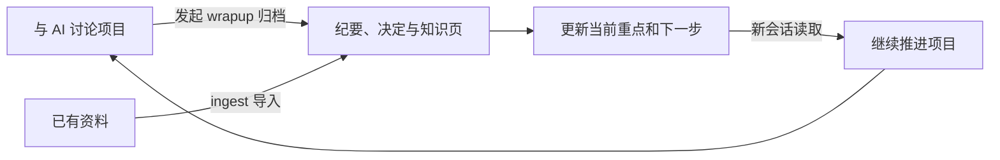

# Loom

[English](README.md) | **简体中文**

**让下一次 AI 会话，从上一次项目进展继续。**

每开一个新会话，AI 都从零开始：背景要重讲一遍，资料要重贴一遍，上周想清楚的结论埋在聊天记录里，已经定下的事又被重新讨论。项目做得越久，这种重复交代的成本越高。

Loom 是一个供 AI 助手使用的项目知识库 skill。它帮助你把资料、讨论、决策和下一步整理为本地 Markdown 文件，让下一次会话可以读取已保存的项目上下文，继续推进研究或开发。

- **接上进度：** 保存当前重点、已做决定和下一步，新会话从这些信息开始。
- **找到依据：** 知识页、决策和产出物链接到相关资料或纪要。
- **保留自己的文件：** 内容是本地 Markdown，可用 git 管理，也可用 Obsidian 浏览。

三件事先说清楚：

- **怎么用：** 用自然语言——"用 Loom 初始化这个项目"、"归档刚才的讨论"、"导入这些资料"。AI 按 Loom 规定的流程读写项目文件夹里的文件。
- **哪些是自动的：** 归档由你发起。在 Claude Code 中，hook 另会在会话结束时导出原始对话、在会话开始时注入当前重点；其他工具没有这一层（见[支持范围](#支持范围与隐私)）。
- **结果在哪里：** 就在你的项目文件夹里——一组互相链接的 Markdown 文件，每次改动由 git 记录。

> skill 是让 AI 按固定流程操作文件的一组说明和脚本。Loom 遵循开放的 [Agent Skills](https://agentskills.io) 标准：在本机安装一次，所有项目共用；项目文件夹里只存放数据。

## 适合谁

**适合你，如果：**

- 你用的 AI 助手能读写本地文件、执行命令（例如 Claude Code）；
- 你在同一个项目上反复和 AI 工作，跨越几天到几个月——做调研、定方案、写代码、写文档；
- 你希望讨论的结论、依据和决定留在自己手里，而不是散落在各个工具的聊天记录中。

起点可以是一句话的想法、一堆已有的资料（文档、PDF、网页存档），或者一个到几个已有的代码库。

**暂时不适合，如果：**

- 你只用网页聊天窗口，AI 接触不到本地文件；
- 你期待"装上就自动记住一切"——归档需要你发起，原始对话的自动导出目前只支持 Claude Code；
- 你需要多人实时协同编辑——Loom 的分享方式是发布审阅过的快照。

**Loom 不是什么：** 它不改变模型本身的记忆，做的是把项目记录保存下来、整理好，并在需要时让 AI 去读。它没有向量数据库、后台服务或 Web 界面，只有文件、git 和 Python 标准库脚本。Obsidian 可以用来浏览这些文件，但不是开始使用的前提。

## 一次完整循环

下面用一个虚构的演示项目 `reading-notes-demo`（个人阅读摘录工具；所有内容都是演示设定）说明。整个过程是三句话：

```text
用 Loom 初始化这个项目，目标是做一个个人阅读摘录工具。

用 Loom 归档刚才的讨论，记录首版范围的决定和下一步。

这是 Loom 项目。请先读 hot.md 和相关决策，再继续完善首版功能清单。
```

第三句是*新会话*中的自然语言请求——没有"resume"命令，读取已保存的上下文就是续接。

第二句（归档）留下了什么：

| 归档前 | 归档后 | 下一次会话如何使用 |
|---|---|---|
| 本轮聊天里的讨论 | 一份[纪要](examples/reading-notes/zh-CN/40-Sessions/notes/2026-10-01_首版范围讨论.md)，记录结论与未决问题 | 需要背景时查看 |
| 口头决定暂缓多人共享 | 一份[决策记录](examples/reading-notes/zh-CN/40-Sessions/decisions/DR-2026-001_首版本地摘录.md)，含选项对比、理由、反方论证和复盘日期 | 避免重复讨论，约束变化时再复盘 |
| 聊天里的待办事项 | [hot.md](examples/reading-notes/zh-CN/00-Hub/hot.md) 与 [roadmap](examples/reading-notes/zh-CN/00-Hub/roadmap.md) 更新 | 知道从哪个下一步继续 |

新会话最先读到的 `00-Hub/hot.md`，归档后是这样的（节选）：

```markdown
## 当前重点
- 把首版范围（[[首版范围]]）落成具体的功能清单。

## 未决问题
- 摘录攒到几百条后，纯文本检索还够用吗？

## 最近的决定
- [[DR-2026-001_首版本地摘录]]：首版支持本地摘录和检索，暂缓共享。

## 下一步
- 写出首版最小功能清单——见 [[roadmap]]
```

完整的示例文件在 [`examples/reading-notes/zh-CN/`](examples/reading-notes/zh-CN/)（英文版在 [`examples/reading-notes/en/`](examples/reading-notes/en/)）。想动手试时，**把示例复制到一个独立目录**——不要在 Loom 源码仓库里初始化。



核心归档由你发起。Claude Code 的 hook（原始对话导出、上下文注入）是单独的增强层：原始对话导出不做语义整理，不等于 wrapup。

## 快速开始

依赖：**Python 3.12+** 和 **git**。Claude Code 的 hook 另外需要可工作的 **Bash**（Windows 上是 Git for Windows 自带的 Git Bash）。

**1. 安装**

Windows：

```powershell
git clone https://github.com/Maxwell-FreeFOV/loom.git loom
cd loom
py tools/deploy.py
```

macOS / Linux：

```bash
git clone https://github.com/Maxwell-FreeFOV/loom.git loom
cd loom
python3 tools/deploy.py
```

skill 本体会放到 `~/.agents/skills/loom`，然后链接进已安装工具的 skills 目录（默认 `~/.claude/skills/loom` 和 `~/.codex/skills/loom`；用 `--agents claude,codex,gemini` 指定）。部署前会先跑一遍仓库自带的端到端测试，其中的 hook 测试需要 Bash；没有 Bash 或想跳过时加 `--skip-tests`。

也可以把 `skills/loom/` 手工复制到某个工具的 skills 目录，或者用 [skills CLI](https://github.com/vercel-labs/skills)：`npx skills add Maxwell-FreeFOV/loom -g --skill loom`（需要 Node/npm）。

**2. 创建项目**

```bash
mkdir my-project && cd my-project
```

在这个文件夹里启动 AI，说：*"用 Loom 初始化这个项目。"* AI 会先访谈你（项目名、项目性质、已有资料），然后生成目录结构、`AGENTS.md`、项目简报和 `hot.md`。文件夹里已经有资料也没关系，初始化会把它们登记进来。

**3. 第一次归档**

和 AI 讨论一阵之后，说：*"用 Loom 归档刚才的讨论。"*（Claude Code 中也可以输入 `/loom wrapup`。）AI 会写一份会话纪要；有决定时写决策记录；更新知识页、路线图和 `hot.md`；最后在项目自己的 git 仓库里提交一次。

**4. 下一次会话**

在同一个文件夹里开新会话。Claude Code 中，hook 会自动把 `hot.md` 和提醒注入会话开头；其他工具靠 `AGENTS.md` 里的提示让 AI 自己去读。也可以直接说：*"这是 Loom 项目，先读 hot.md，然后继续 ……"*

**确认装好了**

1. 运行 `doctor` 检查环境——Windows：`py "$HOME/.agents/skills/loom/scripts/loom.py" doctor`；macOS/Linux：`python3 ~/.agents/skills/loom/scripts/loom.py doctor`。
2. AI 的技能列表里能看到 `loom`；初始化之后，项目里出现 `.kb.json`、`AGENTS.md`、`00-Hub/hot.md`、`10-Brief/project-brief.md`。
3. Claude Code 中：在 Loom 项目里开新会话，开头应出现"Loom 项目上下文"；会话结束后，`40-Sessions/raw/` 下出现导出的对话。`doctor` 只检查文件和配置，不能证明 hook 已生效，以这一条实测为准。

如果某个 Claude Code 版本没有把 skill 目录加载为插件，可以用 `py tools/deploy.py --claude-hooks` 兜底，把同样的 hook 写进 `~/.claude/settings.json`。

不通过 AI、直接建项目也可以：`py "$HOME/.agents/skills/loom/scripts/loom.py" init --name my-project --language zh-CN`（macOS/Linux 把 `py` 换成 `python3`；英文项目用 `--language en`，省略时默认英文）。

## 它解决的问题

| 常见困难 | Loom 的做法 | 在示例里看 |
|---|---|---|
| 下次会话不知道做到哪里，又要从头交代 | `00-Hub/hot.md` 保存当前重点、未决问题和下一步，每次会话最先读 | [hot.md](examples/reading-notes/zh-CN/00-Hub/hot.md)、[roadmap](examples/reading-notes/zh-CN/00-Hub/roadmap.md) |
| 聊天里有结论，事后找不到、用不上 | wrapup 把讨论整理成纪要，把新的理解写进按主题组织的知识页 | [纪要](examples/reading-notes/zh-CN/40-Sessions/notes/2026-10-01_首版范围讨论.md)、[知识页](examples/reading-notes/zh-CN/30-Wiki/首版范围.md) |
| 忘了当初为什么这样选，同一件事反复讨论 | 一个决定一份记录：选项、取舍、最强反方论证、信心度和复盘日期 | [DR-2026-001](examples/reading-notes/zh-CN/40-Sessions/decisions/DR-2026-001_首版本地摘录.md) |
| 资料越积越多，知识没有跟着更新；结论说不清出处 | ingest 保留原件、登记来源、写资料卡，再整合进知识页，每个论断标注来源 | [原件](examples/reading-notes/zh-CN/20-Sources/raw/方案备选.md) → [资料卡](examples/reading-notes/zh-CN/20-Sources/cards/方案备选-资料卡.md) → [知识页](examples/reading-notes/zh-CN/30-Wiki/首版范围.md) |
| 项目横跨多个代码库，背景和决定不知道放哪 | 项目背景放在知识库，代码库放在 `repos/` 下各自独立管理 | 见下文"工程开发" |
| 想分享结论，又不想把全部过程交出去 | publish 导出审阅过的快照，不含对话、纪要和历史 | 见下文"写产出物、对外分享" |

这样做换来的是：新会话不必重讲背景；每个结论和决定都能追到依据；知识随项目积累，而不是随聊天窗口关闭而散失；所有内容都是你自己的文件，换一个 AI 工具也带得走。

## 三种常见用法

核心循环（讨论 → 归档 → 续接）对任何项目都一样。下面三类用法按需启用，对应三个可选模块。

**调研与研究。** 你有一批论文、报告、网页要消化。把文件放进 `20-Sources/inbox/`，说"用 Loom 导入这些资料"：原件原样存入 `raw/`，登记到资料清单，重要的写资料卡，新知识整合进知识页并标注来源；和已有认识冲突的地方会单独报告给你。`research` 模块另外提供文献卡和实验记录模板。

**工程开发。** 方案讨论、设计文档和决定放在知识库；代码库登记在 `repos.yaml`、放在 `repos/` 下，各自是独立的 git 仓库，知识库不跟踪它们的内容。在某个代码库目录里启动会话写代码时，AI 仍然可以回到知识库查设计和决策。`engineering` 模块提供设计文档和 ADR 模板，决策记录里可以关联对应的 commit。

**写产出物、对外分享。** 给别人看的设计文档和报告放在 `50-Outputs/`（`outputs` 模块），带版本和状态，并链接它依据的纪要、决策和知识页。需要把成果交给合作者时，用 `publish` 生成一个快照 zip：只含当前的状态和结果，对话、纪要、决策记录和历史永远不进快照；生成前 AI 会列出文件清单和需要留意的内容（本机路径、邮箱、疑似密钥），由你确认。对方把 zip 交给自己的 Loom 项目 `ingest` 即可导入。

全部操作（Claude Code 中写作 `/loom <操作>`，其他工具中直接说"用 loom 做 ……"）：

| 操作 | 作用 |
|---|---|
| `init` | 初始化项目：访谈、选择模块、生成目录和项目简报、登记已有资料 |
| `wrapup` | 讨论结束时归档：写纪要和决策记录，更新 wiki、时间线、路线图和 hot.md |
| `ingest` | 导入资料：原件存入 `raw/`，登记到资料清单，写资料卡，整合进 wiki。也用来导入合作者发布的快照 |
| `publish` | 把可公开的内容发布成快照（一个 zip）：不含对话、纪要、决策记录和历史，发布前由 AI 审阅、你确认 |
| `lint` | 知识库体检：死链、孤立页、未登记的资料、未归档的会话、到期的决策 |
| `module` | 启用模块：`research`（文献卡、实验记录）、`engineering`（关联代码库）、`outputs`（带版本的产出物） |
| `migrate` | Loom 升级后迁移项目结构 |
| `close` | 项目暂停或结束时复盘 |

## 支持范围与隐私

**语言。** 项目用 `init --language en|zh-CN` 创建为英文或中文项目；项目文件、模板、索引和报告都按项目语言生成。旧版 Loom 创建的项目按中文处理，并保持中文。**skill 的执行规则（`SKILL.md` 与 `references/`）目前只有中文。** 你可以用英文驱动全部功能——脚本是语言中立的——但规则文档本身尚未英文化，英文规则的行为等价性也未经验证。

**工具差异。** Loom 目前在 **Claude Code** 中实测使用。它是标准的 Agent Skill，按设计可以在其他能执行本地命令的工具中使用，但在这些工具中的触发和流程遵守情况还没有做过完整验证，欢迎反馈。原始对话的自动导出和上下文注入**只在 Claude Code 中**可用，由 hook 完成：

| 能力 | Claude Code | 其他支持 Agent Skills 的工具（Codex、Gemini CLI 等） |
|---|---|---|
| 初始化、归档、导入资料、发布快照、体检、模块、迁移 | ✅ | 按设计可用（需要 AI 能执行本地命令），尚未完整验证 |
| 会话结束时自动导出对话 | ✅ 由 hook 完成 | ❌ 对话不会进入 `40-Sessions/raw/`，靠会话纪要留存 |
| 会话开始时自动注入 hot.md 和提醒 | ✅ 由 hook 完成 | ❌ 靠 `AGENTS.md` 中的提示，由 AI 自己去读 |
| 执行 Loom 操作时补导出之前的对话 | ✅ | ❌（目前只支持 Claude Code 的会话记录格式） |
| 调用方式 | `/loom <操作>`，或用自然语言 | 自然语言；有时需要明确说"用 loom" |

在 Claude Code 中，skill 目录里的 `.claude-plugin/plugin.json` 和 `hooks/hooks.json` 会让它被加载为插件 `loom@skills-dir`，hook 由此而来；其他工具会忽略这两个文件。

**其他注意事项：**

- Claude Code 会按 `cleanupPeriodDays` 定期清理会话记录（默认约 30 天）。Loom 从这些记录补导出对话，建议在 `~/.claude/settings.json` 中把它设为 365 或更大。
- 所有项目共用同一个 Loom 版本。新版本改变项目结构时，用 `migrate` 把每个项目迁移一次。

**隐私与 git。**

- 知识库是本地的 Markdown 文件，但 AI 助手读到的内容会被发送到你使用的 AI 服务——文件存在本地不等于内容不会离开电脑。
- Claude Code 的 hook 会在 Loom 项目的会话结束时把原始对话导出到 `40-Sessions/raw/`；它只在 Loom 项目中生效，删掉 hook 即可停用。
- 归档、导入、发布完成后，AI 会在项目自己的 git 仓库里各提交一次，流程要求只提交本次涉及的文件。原始对话和资料默认也会进入这个本地仓库，不想提交的文件用 `.gitignore` 排除。Loom 不创建远端，也不推送；hook 默认不改写已有的提交（`.kb.json` 的 `auto_amend` 默认关闭）。
- 建议项目库保持私有。要分享时用可审阅的快照（`publish`）——快照不含对话和历史，生成前你会确认文件清单。清洗规则是机械的，不能替代你对内容的审阅。

## 进一步阅读

**项目的目录结构：**

```
<项目>/
├── .kb.json          项目名、模块、结构版本、语言
├── AGENTS.md         项目指令（含一段由 Loom 维护的区块）；CLAUDE.md 只引用它
├── 00-Hub/           当前重点（hot）· 索引 · 时间线 · 路线图 · 日志
├── 10-Brief/         项目简报：问题、目标、范围、约束
├── 20-Sources/       待处理（inbox）· 原始资料 · 资料卡 · 资料清单
├── 30-Wiki/          AI 维护的知识页
├── 40-Sessions/      原始对话 · 会话纪要 · 决策记录
├── 50-Outputs/       产出物（outputs 模块）
└── repos/ + repos.yaml   关联的代码库（engineering 模块；各自是独立的 git 仓库）
```

**更多文档：**

- 操作参考与规则：[`skills/loom/SKILL.md`](skills/loom/SKILL.md) 与 [`skills/loom/references/`](skills/loom/references/)
- 升级后的项目迁移：[`skills/loom/references/migrate.md`](skills/loom/references/migrate.md)
- 卸载与回滚：[`docs/uninstall.md`](docs/uninstall.md)
- 安全问题报告：[SECURITY.md](SECURITY.md)
- 版本变化：[CHANGELOG.md](CHANGELOG.md)
- 参与开发：[CONTRIBUTING.md](CONTRIBUTING.md)

## 参考与致谢

- Andrej Karpathy 的 LLM Wiki 模式：原始资料不可变，wiki 由 LLM 维护，由一份 schema 约束 LLM 的行为；核心操作是 ingest、query、lint。
- [claude-obsidian](https://github.com/AgriciDaniel/claude-obsidian)：借鉴了它的若干约定，包括 inbox → raw → wiki 的资料流、用标记文件识别知识库、hot/index/log 三件套。
- [Agent Skills](https://agentskills.io) 规范。
